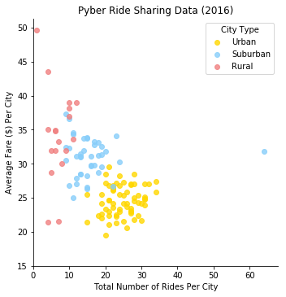
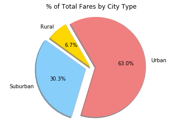
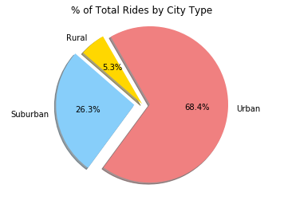
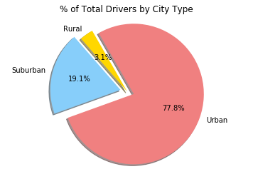

```python
#import dependencies
import matplotlib.pyplot as plt
import seaborn as sns
import pandas as pd
import numpy as np
%matplotlib inline
```


```python
#reading data from files
city_data = pd.read_csv('raw_data/city_data.csv')
ride_data = pd.read_csv('raw_data/ride_data.csv')

#combine data into dataset
city_data = city_data.drop_duplicates()
pyber_data = pd.merge(city_data,ride_data,how='right',on='city' )

pyber_data.head()


```


<div>
<style>
    .dataframe thead tr:only-child th {
        text-align: right;
    }

    .dataframe thead th {
        text-align: left;
    }

    .dataframe tbody tr th {
        vertical-align: top;
    }
</style>
<table border="1" class="dataframe">
  <thead>
    <tr style="text-align: right;">
      <th></th>
      <th>city</th>
      <th>driver_count</th>
      <th>type</th>
      <th>date</th>
      <th>fare</th>
      <th>ride_id</th>
    </tr>
  </thead>
  <tbody>
    <tr>
      <th>0</th>
      <td>Kelseyland</td>
      <td>63</td>
      <td>Urban</td>
      <td>2016-08-19 04:27:52</td>
      <td>5.51</td>
      <td>6246006544795</td>
    </tr>
    <tr>
      <th>1</th>
      <td>Kelseyland</td>
      <td>63</td>
      <td>Urban</td>
      <td>2016-04-17 06:59:50</td>
      <td>5.54</td>
      <td>7466473222333</td>
    </tr>
    <tr>
      <th>2</th>
      <td>Kelseyland</td>
      <td>63</td>
      <td>Urban</td>
      <td>2016-05-04 15:06:07</td>
      <td>30.54</td>
      <td>2140501382736</td>
    </tr>
    <tr>
      <th>3</th>
      <td>Kelseyland</td>
      <td>63</td>
      <td>Urban</td>
      <td>2016-01-25 20:44:56</td>
      <td>12.08</td>
      <td>1896987891309</td>
    </tr>
    <tr>
      <th>4</th>
      <td>Kelseyland</td>
      <td>63</td>
      <td>Urban</td>
      <td>2016-08-09 18:19:47</td>
      <td>17.91</td>
      <td>8784212854829</td>
    </tr>
  </tbody>
</table>
</div>


```python

average_fare_per_city = pyber_data.groupby('city')['fare'].mean()
Total_Number_of_Rides_Per_City = pyber_data.groupby('city')['ride_id'].count()

Total_Number_of_Drivers_Per_City = city_data.groupby('city')['driver_count'].sum()

city_df_unique = city_data.drop_duplicates('city',keep='first')

grouped
City_Type = city_df_unique.set_index(['city'])['type']


```


```python
scatter_plt_data = pd.DataFrame({"City Type":City_Type,
                                "Average Fare ($) Per City":average_fare_per_city,
                                 "Total Number of Rides Per City":Total_Number_of_Rides_Per_City,
                                 "Total Number of Drivers Per City":Total_Number_of_Drivers_Per_City
                                })
(scatter_plt_data).head()
```


<div>
<style>
    .dataframe thead tr:only-child th {
        text-align: right;
    }

    .dataframe thead th {
        text-align: left;
    }

    .dataframe tbody tr th {
        vertical-align: top;
    }
</style>
<table border="1" class="dataframe">
  <thead>
    <tr style="text-align: right;">
      <th></th>
      <th>Average Fare ($) Per City</th>
      <th>City Type</th>
      <th>Total Number of Drivers Per City</th>
      <th>Total Number of Rides Per City</th>
    </tr>
  </thead>
  <tbody>
    <tr>
      <th>Alvarezhaven</th>
      <td>23.928710</td>
      <td>Urban</td>
      <td>21</td>
      <td>31</td>
    </tr>
    <tr>
      <th>Alyssaberg</th>
      <td>20.609615</td>
      <td>Urban</td>
      <td>67</td>
      <td>26</td>
    </tr>
    <tr>
      <th>Anitamouth</th>
      <td>37.315556</td>
      <td>Suburban</td>
      <td>16</td>
      <td>9</td>
    </tr>
    <tr>
      <th>Antoniomouth</th>
      <td>23.625000</td>
      <td>Urban</td>
      <td>21</td>
      <td>22</td>
    </tr>
    <tr>
      <th>Aprilchester</th>
      <td>21.981579</td>
      <td>Urban</td>
      <td>49</td>
      <td>19</td>
    </tr>
  </tbody>
</table>
</div>


```python

pkmn_type_colors = ['#FFD700',  # Gold
                    '#00BFFF', #light blue
                    '#FF7F50' #coral
                   ]


sns.lmplot(x="Total Number of Rides Per City",y="Average Fare ($) Per City",
           palette=dict(Urban='gold', Rural='lightcoral',Suburban = 'lightskyblue'), # palette=pkmn_type_colors,
           data=scatter_plt_data, fit_reg=False,hue= "City Type",scatter=True , legend=False) 

plt.ylim(15, None)
plt.xlim(0, None)
plt.title("Pyber Ride Sharing Data (2016)")
plt.legend(loc='upper right',title="City Type")
plt.show()
```





```python
#% of Total Fares by City Type
pyber_data.head()
cleaned = pyber_data.drop_duplicates()

total_fare =  pyber_data['fare'].sum()
total_fare
percent_fare_by_city = pyber_data.groupby('type')['fare'].sum()/total_fare*100
#percent_fare_by_city
#fare_by_city
#% of Total Rides by City Type
total_rides = pyber_data['ride_id'].nunique()
percent_of_total_rides = pyber_data.groupby('type')['ride_id'].count()/total_rides*100
#percent_of_total_rides
#% of Total Drivers by City Type
total_drivers = city_data['driver_count'].sum()
percent_of_total_drivers = city_data.groupby('type')['driver_count'].sum()/total_drivers*100

pie_df = pd.DataFrame({"% of Total Fares by City Type":percent_fare_by_city,
                      "% of Total Rides by City Type":percent_of_total_rides,
                      "% of Total Drivers by City Type":percent_of_total_drivers
                      }
                       )
pie_df = pie_df.reset_index(['type'])


type_df = pie_df['type']


```

## % of Total Fares by City Type


```python
colors = ['gold', 'lightskyblue','lightcoral']

explode = (0, 0.1, 0.1)

plt.pie(percent_fare_by_city,explode=explode, autopct='%1.1f%%',startangle=120,labels = type_df,colors = colors,shadow=True )

plt.title("% of Total Fares by City Type")
plt.axis('equal')
plt.show()
```





## % of Total Rides by City Type


```python
plt.pie(percent_of_total_rides,explode=explode, autopct='%1.1f%%',startangle=120,labels = type_df,colors = colors,shadow=True )

plt.title("% of Total Rides by City Type")
plt.axis('equal')
plt.show()
```





## % of Total Drivers by City Type


```python
plt.pie(percent_of_total_drivers,explode=explode, autopct='%1.1f%%',startangle=120,labels = type_df,colors = colors,shadow=True )

plt.title("% of Total Drivers by City Type")
plt.axis('equal')
plt.show()
```




